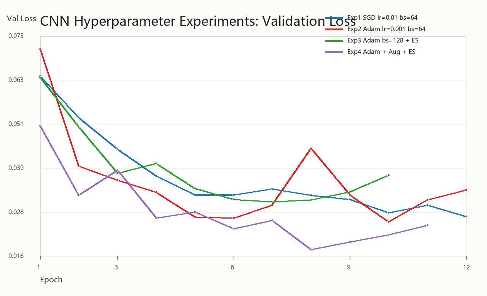
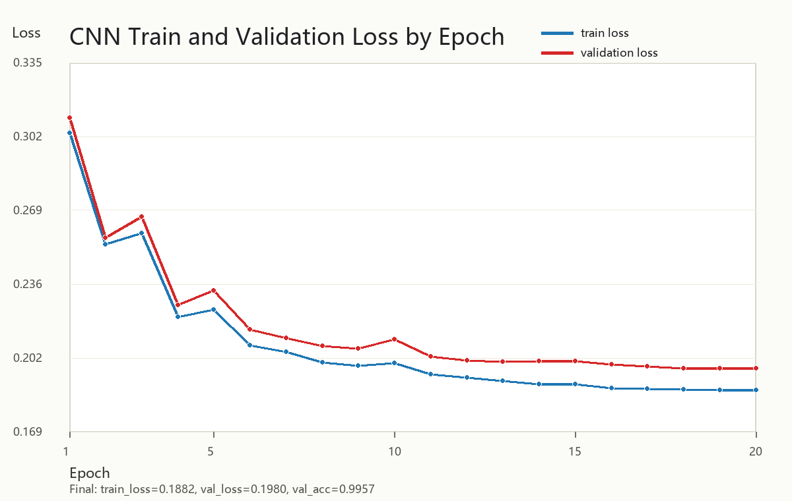

# 机器学习实验：基于 CNN 的手写数字识别

## 1. 学生信息

- **姓名**：赵丹
- **学号**：112304260138
- **班级**：数据1231

***

## 项目在线链接

- **Render 在线部署网址**：[https://zhaodan-mnist-cnn-digit.onrender.com](https://zhaodan-mnist-cnn-digit.onrender.com)
- **GitHub README / 实验报告**：[https://github.com/zhaodan24/112304260138zhaodan-2/blob/main/README.md](https://github.com/zhaodan24/112304260138zhaodan-2/blob/main/README.md)
- **GitHub 仓库地址**：[https://github.com/zhaodan24/112304260138zhaodan-2](https://github.com/zhaodan24/112304260138zhaodan-2)

***

## 2. 实验概述

本实验基于 Kaggle Digit Recognizer / MNIST 手写数字识别任务，使用卷积神经网络（CNN）完成手写数字分类。实验主要包括模型训练、超参数调优、Kaggle 提交结果生成，以及后续 Web 应用部署准备。

本次最终提交文件为 `submission_cnn.csv`，Kaggle 提交记录显示得分为 **0.99639**，达到实验要求的 `0.98+` 目标。

***

## 3. 实验环境

| 项目 | 配置 |
| --- | --- |
| 操作系统 | Windows |
| Python | Python 3.12 |
| 深度学习框架 | PyTorch 2.11.0 + CUDA 12.6 |
| GPU | NVIDIA GeForce RTX 4060 Laptop GPU |
| 数据集 | Kaggle Digit Recognizer：`train.csv`、`test.csv`、`sample_submission.csv` |
| 主要依赖 | torch、torchvision、numpy、Pillow |

***

## 实验一：模型训练与超参数调优（必做）

### 1.1 实验目标

使用 CNN 对 28×28 灰度手写数字图像进行 0-9 十分类识别。通过对比不同优化器、学习率、Batch Size、数据增强和 Early Stopping 设置，分析超参数对模型收敛速度和泛化能力的影响，并生成 Kaggle 可提交的预测结果文件。

### 1.2 模型结构

对比实验中使用基础 CNN 结构：

```text
输入(1×28×28)
→ Conv2d(1, 32, 3×3) + ReLU + MaxPool
→ Conv2d(32, 64, 3×3) + ReLU + MaxPool
→ Flatten
→ Linear(64×7×7, 128) + ReLU + Dropout
→ Linear(128, 10)
→ 输出10类数字
```

最终提交模型在基础 CNN 上进行了增强，使用多层卷积块：

```text
ConvBlock(1→48)
→ MaxPool
→ ConvBlock(48→96)
→ MaxPool
→ ConvBlock(96→192)
→ Conv2d(192→256)
→ AdaptiveAvgPool2d
→ Dropout
→ Linear(256→10)
```

其中 `ConvBlock` 由 `Conv2d + BatchNorm2d + SiLU + Conv2d + BatchNorm2d + SiLU + Dropout2d` 组成。

### 1.3 超参数对比实验

本实验完成了 4 组对比实验。训练集按标签分层划分训练集和验证集，验证集比例为 10%。由于 Kaggle 测试集没有公开标签，因此表格中的 `Test Acc` 标记为 `N/A`，模型性能主要通过验证集准确率和 Kaggle 提交分数评估。

| 实验编号 | 优化器 | 学习率 | Batch Size | 数据增强 | Early Stopping |
| --- | --- | --- | --- | --- | --- |
| Exp1 | SGD | 0.01 | 64 | 否 | 否 |
| Exp2 | Adam | 0.001 | 64 | 否 | 否 |
| Exp3 | Adam | 0.001 | 128 | 否 | 是 |
| Exp4 | Adam | 0.001 | 64 | 是 | 是 |

对比实验结果如下：

| 实验编号 | Train Acc | Val Acc | Test Acc | 最低 Loss | 收敛 Epoch |
| --- | ---: | ---: | ---: | ---: | ---: |
| Exp1 | 99.90% | 99.14% | N/A | 0.02637 | 12 |
| Exp2 | 99.87% | 99.29% | N/A | 0.02494 | 10 |
| Exp3 | 99.69% | 99.14% | N/A | 0.03036 | 7 |
| Exp4 | 99.63% | 99.38% | N/A | 0.01744 | 8 |

从结果可以看出，加入数据增强和 Early Stopping 的 Exp4 获得了最低验证集 Loss，验证集准确率也最高，说明数据增强对模型泛化能力有明显帮助。

### 1.4 最终提交模型

最终提交 Kaggle 时使用的模型不是单个基础 CNN，而是进一步增强后的 CNN，并使用两个随机种子模型进行集成预测。

| 配置项 | 我的设置 |
| --- | --- |
| 优化器 | AdamW |
| 学习率 | 0.003 |
| Batch Size | 512 |
| 训练 Epoch 数 | 26 |
| 是否使用数据增强 | 是 |
| 数据增强方式 | 随机旋转（约 ±12°）、随机平移（约 ±10%）、随机缩放（0.90-1.10） |
| 是否使用 Early Stopping | 否，训练过程中保存验证集最优模型 |
| 是否使用学习率调度器 | 是，OneCycleLR |
| 其他调整 | BatchNorm、SiLU、Dropout、AdamW 权重衰减、两组 seed 模型集成、TTA 测试时增强 |
| **Kaggle Score** | **0.99639** |

关键优化器代码如下：

```python
optimizer = torch.optim.AdamW(model.parameters(), lr=0.003, weight_decay=1e-4)
```

正式训练中两个随机种子的验证集最好结果如下：

| 模型 | 最好 Val Acc |
| --- | ---: |
| seed=2026 | 0.996429 |
| seed=4060 | 0.998413 |

最终预测时对两个模型的输出概率进行平均，并结合 TTA 测试时增强生成 `submission_cnn.csv`。提交文件共 28000 行，包含 `ImageId` 和 `Label` 两列，满足 Kaggle 提交格式要求。

### 1.5 Loss 曲线

4 组超参数对比实验的验证集 Loss 曲线如下：



最终 CNN 模型训练集和验证集 Loss 曲线如下：



最终 CNN 曲线补跑记录显示，第 20 个 epoch 时：

| 指标 | 数值 |
| --- | ---: |
| Train Loss | 0.1882 |
| Val Loss | 0.1980 |
| Train Acc | 0.9996 |
| Val Acc | 0.9957 |

### 1.6 分析问题

**Q1：Adam 和 SGD 的收敛速度有何差异？从实验结果中你观察到了什么？**

Adam 的收敛速度整体快于 SGD。Exp2 使用 Adam 后，第 2 个 epoch 的验证 Loss 已下降到 0.03997，而 Exp1 使用 SGD 时第 2 个 epoch 验证 Loss 为 0.05297。Adam 会根据梯度的一阶矩和二阶矩自适应调整参数更新幅度，因此在训练前期通常更快达到较低 loss。SGD 虽然也能收敛到较好结果，但前期下降速度相对慢一些。

**Q2：学习率对训练稳定性有什么影响？**

学习率决定了每次参数更新的步长。学习率过大时，模型可能在最优点附近震荡，导致验证 loss 波动；学习率过小时，训练会变慢，可能需要更多 epoch 才能收敛。本实验最终模型使用 OneCycleLR 学习率调度器，让学习率先升后降，在前期加快探索，后期降低步长，有助于稳定收敛并获得更好的泛化效果。

**Q3：Batch Size 对模型泛化能力有什么影响？**

Batch Size 会影响梯度估计的噪声。较小 Batch Size 的梯度噪声更大，有时能帮助模型跳出局部区域，提升泛化；较大 Batch Size 训练更稳定，但可能泛化略弱。Exp2 和 Exp3 都使用 Adam，主要差异是 Batch Size 和 Early Stopping。Exp2 的最低验证 loss 为 0.02494，Exp3 为 0.03036，说明在本实验设置下，Batch Size=64 的泛化表现略好。

**Q4：Early Stopping 是否有效防止了过拟合？**

Early Stopping 能在验证集 loss 不再改善时提前停止训练，减少继续拟合训练集噪声的风险。Exp3 在第 10 个 epoch 触发早停，Exp4 在第 11 个 epoch 触发早停。尤其是 Exp4 中，模型在第 8 个 epoch 达到最低验证 loss 0.01744，之后验证 loss 开始回升，早停避免了后续过拟合继续加重。

**Q5：数据增强是否提升了模型的泛化能力？为什么？**

数据增强提升了模型泛化能力。Exp4 加入随机旋转和平移后，最低验证 loss 降至 0.01744，明显优于未增强的 Exp1、Exp2 和 Exp3。手写数字在真实场景中会存在轻微倾斜、位置偏移和大小变化，数据增强相当于人为扩充了训练样本分布，使模型学习到更稳健的形状特征，而不是只记住训练集中固定位置和角度的数字。

### 1.7 提交清单

- [x] 对比实验结果表格（1.3）
- [x] 最终模型超参数配置（1.4）
- [x] Loss 曲线图（1.5）
- [x] 分析问题回答（1.6）
- [x] Kaggle 预测结果 CSV：`submission_cnn.csv`
- [x] Kaggle Score 截图：用户已提供 `submission_cnn.csv` 提交记录截图，Score=0.99639

***

## 实验二：模型封装与 Web 部署（必做）

### 2.1 实验目标

将实验一训练好的 CNN 模型封装为 Web 应用，使用户可以上传手写数字图片，系统自动完成图像预处理、模型推理并返回预测数字。

### 2.2 技术方案

计划使用 Gradio 实现 Web 页面，基本流程如下：

```text
用户上传图片
→ 转为灰度图
→ 调整大小为 28×28
→ 归一化
→ 输入 CNN 模型
→ 输出预测类别和置信度
```

### 2.3 项目结构

为了实现与老师 Render 示例相同的网页效果，最终准备了一个 FastAPI + 原生 HTML/Canvas 的 Render 版项目，目录为 `digit_cnn_render_app`。

```text
digit_cnn_render_app/
├── main.py              # FastAPI 应用入口，提供网页和预测 API
├── model.py             # CNN 模型结构
├── model.pth            # 训练好的 CNN 权重
├── requirements.txt     # 依赖列表
├── Procfile             # Render 启动命令
├── render.yaml          # Render 部署配置
├── README.md            # 项目说明
└── submission_cnn.csv   # Kaggle 最终提交文件
```

其中 `main.py` 提供 3 个核心接口：

- `/`：返回手写数字识别网页
- `/api/predict-upload`：识别上传图片
- `/api/predict-canvas`：识别网页手写板内容

页面在功能上覆盖老师示例，并在界面展示上增加了模型状态标签、置信度圆环、Top-3 表格、0-9 概率分布条形图和连续识别历史。

### 2.4 部署平台

本项目选择 Render 作为公网部署平台，并已经完成 GitHub 仓库连接和 Web Service 部署。仓库内包含 `Procfile` 与 `render.yaml`，Render 构建完成后使用下面命令启动 FastAPI 服务：

```bash
uvicorn main:app --host 0.0.0.0 --port $PORT
```

最终部署结果如下：

| 平台 | 部署结果 |
| --- | --- |
| GitHub | 代码、模型权重、提交文件和 README 实验报告已上传到仓库 [https://github.com/zhaodan24/112304260138zhaodan-2](https://github.com/zhaodan24/112304260138zhaodan-2) |
| Render | 已创建并部署 Web Service：`zhaodan-mnist-cnn-digit` |
| 在线系统 | [https://zhaodan-mnist-cnn-digit.onrender.com](https://zhaodan-mnist-cnn-digit.onrender.com) |
| 健康检查 | [https://zhaodan-mnist-cnn-digit.onrender.com/health](https://zhaodan-mnist-cnn-digit.onrender.com/health)，返回 `status: ok` |

### 2.5 提交信息

| 提交项 | 内容 |
| --- | --- |
| GitHub 仓库地址 | [https://github.com/zhaodan24/112304260138zhaodan-2](https://github.com/zhaodan24/112304260138zhaodan-2) |
| GitHub README / 实验报告 | [https://github.com/zhaodan24/112304260138zhaodan-2/blob/main/README.md](https://github.com/zhaodan24/112304260138zhaodan-2/blob/main/README.md) |
| Render 在线访问链接 | [https://zhaodan-mnist-cnn-digit.onrender.com](https://zhaodan-mnist-cnn-digit.onrender.com) |
| Render 健康检查接口 | [https://zhaodan-mnist-cnn-digit.onrender.com/health](https://zhaodan-mnist-cnn-digit.onrender.com/health) |

Render 版 Web 应用已经完成线上部署并验证通过，支持上传图片识别和网页手写板识别；页面可以显示预测数字、置信度、Top-3 结果、0-9 概率分布和连续识别历史。

### 2.6 提交清单

- [x] Render 版 Web 项目代码：`digit_cnn_render_app`
- [x] 上传图片识别功能
- [x] 网页手写板识别功能
- [x] Top-3 预测结果与概率分布
- [x] 连续识别历史
- [x] GitHub 仓库地址：https://github.com/zhaodan24/112304260138zhaodan-2
- [x] Render 公网在线访问链接：https://zhaodan-mnist-cnn-digit.onrender.com
- [x] 线上页面和预测接口验证通过

***

## 实验三：交互式手写识别系统（选做，加分）

### 3.1 实验目标

在实验二的上传图片识别功能基础上，进一步增加网页手写板，使用户可以直接在网页中手写数字并进行识别。

### 3.2 功能设计

| 功能 | 实现情况 |
| --- | --- |
| 手写输入 | 已使用 HTML Canvas 实现在线手写板 |
| 实时识别 | 已通过 `/api/predict-canvas` 接口将画板图像送入 CNN 模型预测 |
| 连续使用 | 已实现清空画板和连续识别历史 |
| Top-3 结果 | 已显示概率最高的 3 个类别和置信度 |
| 概率分布 | 已显示 0-9 各类别概率条形图 |

### 3.3 当前状态

实验三已在 Render 版应用中实现。页面包含“在线手写板识别”标签页，用户可以直接在网页画板中书写数字，点击按钮后系统会完成图像预处理、CNN 推理，并输出预测数字、置信度、Top-3 结果、概率分布和连续识别历史。

### 3.4 提交信息

| 提交项 | 内容 |
| --- | --- |
| 在线访问链接 | [https://zhaodan-mnist-cnn-digit.onrender.com](https://zhaodan-mnist-cnn-digit.onrender.com) |
| 实现了哪些加分项 | 已实现手写输入、Top-3 预测、概率分布显示、连续识别历史 |

### 3.5 提交清单

- [x] 手写板输入功能
- [x] Top-3 预测结果
- [x] 概率分布显示
- [x] 连续识别历史
- [x] Render 公网在线系统链接：https://zhaodan-mnist-cnn-digit.onrender.com
- [x] 线上手写识别系统已完成部署，可在网页中实时测试

***

## 4. 实验总结

本次实验完成了基于 CNN 的手写数字识别模型训练、超参数调优、Kaggle 提交、Web 应用封装和交互式手写识别系统搭建。实验一中，通过 4 组超参数对比可以看出，数据增强和 Early Stopping 对提升泛化能力有明显帮助；最终 CNN 模型结合 AdamW、OneCycleLR、BatchNorm、Dropout、模型集成和 TTA，在 Kaggle 上获得 **0.99639** 的成绩。

实验二和实验三已经完成公网部署，不再停留在本地测试阶段。线上系统地址为 [https://zhaodan-mnist-cnn-digit.onrender.com](https://zhaodan-mnist-cnn-digit.onrender.com)，GitHub 仓库地址为 [https://github.com/zhaodan24/112304260138zhaodan-2](https://github.com/zhaodan24/112304260138zhaodan-2)，README 文件即本次实验报告。系统支持上传图片识别和网页手写板识别，能够显示预测数字、置信度、Top-3 结果、0-9 概率分布条形图和连续识别历史，满足 Web 展示与交互式识别的实验要求。

